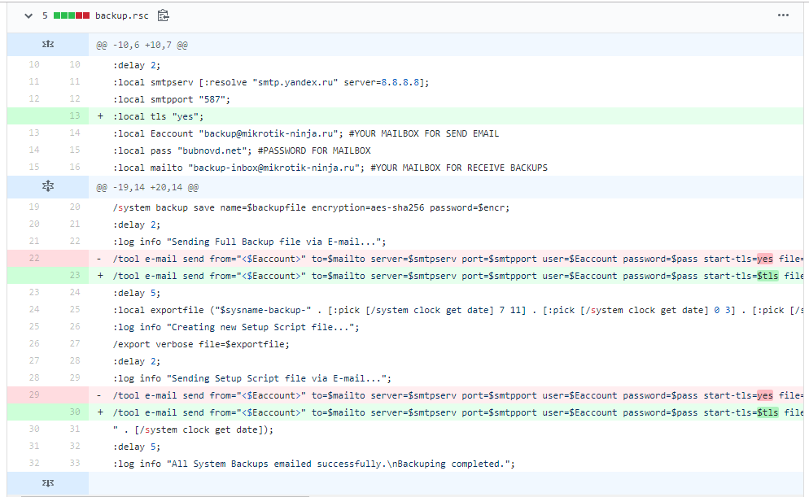

class: title, middle, center
<!-- css classes -->

# Ansible and Docker for Sysadmin

<!-- Notes -->
???
- Кратко о файлах и ансибле
- Рутинные операции 
- Массовые изменения
- Повторяемость
- Документирование
- Версионирование
- История изменений: перестали делаться бэкапы с роутера
- Galaxy
<<<<<<< HEAD
- Иммутабельность
- Идемпотентность
=======
- CI/CD
>>>>>>> 9c00503248200507a7c9acaec96d60e9ec3fbfee
- Есть у меня два друга: Саня и Колян. Оба работают в аутсорсе - средненький такой аутсорс, по 10-20 компаний на обслуживании. Коля - ответственный, работящий парень. Может задержаться на работе, все делает до конца и правильно. Саша наоборот - лентяй, может на работе сериальчики посмотреть. И вообще - нелюбимый сотрудник у начальника. 

- При переходе с debian на RHEL Коля пошел в магазин. За веревкой и мылом
- 

---
class: page
## Кто я

#### <span style="font-size: 1em; color: #2d0b3b;"><i class="fas fa-user fa-fw"></i></span> Дмитрий Бубнов 
#### <span style="font-size: 1em; color: #5aa648;"><i class="fas fa-link fa-fw"></i></span> [Mikrotik Ninja](https://mikrotik-ninja.ru) 
#### <i class="fas fa-home fa-fw"></i> Челябинск, Бишкек 
----
#### <i class="fas fa-graduation-cap fa-fw"></i> Тренер Mikrotik
#### <i class="fas fa-award fa-fw"></i> MTCNA, MTCRE, MTCTCE, MTCWE, MTCINE, CCNA R&S
#### <i class="fas fa-network-wired fa-fw"></i> Сети
#### <i class="fas fa-chart-line fa-fw"></i> Мониторинг
#### <i class="fas fa-magic fa-fw"></i> Автоматизация


---
## <i class="fas fa-table fa-fw"></i> О чем будем говорить

-    Ansible
-    git
-    Docker
-    Docker-compose
-   IaaC
-   Тесты
-   Культура
- https://github.com/geerlingguy/awesome-ansible https://www.digitalocean.com/community/tutorials/the-docker-ecosystem-an-overview-of-containerization
- dOCKER ИНТЕГРИРУЕТСЯ С ОБЛАКАМИ
- swarm
- платформонезависимость

Презентация доступна здесь https://devi1.github.io/Pres_Ansible_docker/

---
##  Что такое Ansible
----
### Просто набор файлов!

```
basic-project
├── inventory
│ ├── group_vars
│ │ └── web.yml
│ ├── host_vars
│ │ └── db1.yml
│ └── hosts
└── site.yml
```
???
From [here](https://www.ansible.com/hubfs/2018_Content/AA%20BOS%202018%20Slides/Ansible%20Best%20Practices.pdf)
---
##  Или так
----
```
myapp
├── roles
│ ├── myapp
│ │ ├── tasks
│ │ │ └── main.yml
│ │ └── ...
│ ├── nginx
│ │ └── ...
│ └── proxy
│ └── ...
└── site.yml
```

---
##  Inventory
----
```
monitoring ansible_host=10.0.0.11 ansible_user=ansible ansible_port=222  ansible_sudo_pass="{{ vault_ansible_sudo_pass  }}"

[prometheus]
monitoring

[mikrotik-exporter]
monitoring

[grafana]
monitoring
```

---
##  Playbook
----
```
- name: Deploy prometheus
  hosts: prometheus
  roles:
    - ansible-prometheus
  tags:
    - prometheus
    - monitoring

- name: Deploy mikrotik-exporter
  hosts: mikrotik-exporter
  roles:
    - ansible-mikrotik-exporter
  tags:
    - monitoring
    - mikrotik-exporter    

- name: Deploy grafana
  hosts: grafana
  roles:
    - ansible-grafana
  tags:
    - grafana
    - monitoring
```
---
##  Запуск плэйбука
----
`ansible-playbook -i inventory.yml monitoring-playbook.yml`

или для отдельной роли

`ansible-playbook -i inventory.yml monitoring-playbook.yml --tags=prometheus`

---
##  Готовые плэйбуки
----
[cloudalchemy/ansible-prometheus](https://github.com/cloudalchemy/ansible-prometheus)

[geerlingguy/ansible-role-mysql](https://github.com/geerlingguy/ansible-role-mysql)


### Тысячи их

[Ansible Galaxy](https://galaxy.ansible.com/)
---
## Нам срочно нужно 5 настроенных виртуалок
----

--
- ### С установленными обновлениями

--
- ### С юзерами, группами и ключами

--
- ### С настроенным фаерволом

--
- ### С установленной и первоначально настроенной MySQL

--
- ### Не забудь добавить их в мониторинг


---
## Нам срочно нужно 5 настроенных виртуалок
----

```
- name: Postinstall configure
  hosts: all
  roles:
    - postinstall-config
  tags:
    - postinstall

- name: Deploy MySQL
  hosts: mysql
  roles:
    - ansible-role-mysql
  tags:
    - database
    - mysql
```
--
## Автоматизация рутинных действий

---
## Нашли баг в Mikrotik, срочно закрой доступ к роутерам!
----

--
- ### 10 клиентов по 10 роутеров у каждого

--
- ### Часть может быть оффлайн

--
- ### При повторном запуске не должны создаваться дублирующие правила

---
## Нашли баг в Mikrotik, срочно закрой доступ к роутерам!
----
```
  - name: add allowed addresses to list
    routeros_command:
      commands: "/ip firewall address-list add list=allow address={{ item }}"
    with_items:
      - "{{ routeros_list_allow }}"

  - name: drop input except allow list
    routeros_command:
      commands: "{{ item }}"
    with_items:
      - /ip firewall filter add chain=input src-address-list=allow action=accept
      - /ip firewall filter add chain=input action=drop
```

--
## Массовые изменения


---
## Помнишь, мы настраивали IPSec три месяца назад? Надо сделать так же новому клиенту
----

--
- ### А на чем мы делали? Гугл показывает libreswan, strongswan, openswan, xl2tpd

--
- ### А как мы там роуты то прописали?

--
- ### Что-то не заводится сразу, видимо что-то забыли


---
## Помнишь, мы настраивали IPSec три месяца назад? Надо сделать так же новому клиенту
----
```
- name: Magic playbook
  hosts: сидящие_в_зале
  roles: 
    - тут_должны_быть_роли
    - но_я_думаю_вы_и_так_все_поняли
```
--
## Повторяемость


---
## У нас новый сотрудник. Покажи ему как у нас все работает
----

--
- ### 10 клиентов

--
- ### Естественно, все они разные

--
- ### Документация. Какая документация?


---
## У нас новый сотрудник. Покажи ему как у нас все работает
----
cat ansible/group_vars/prometheus.yml
```
prometheus_storage_retention: "500d"
prometheus_storage_retention_size: "40GB"
prometheus_web_listen_address: "localhost:9090"

prometheus_alertmanager_config:
  - scheme: http
    static_configs:
      - targets:
        - "127.0.0.1:9093"

prometheus_scrape_configs:
  - job_name: "mikrotik"
    scrape_timeout: "60s"
    scrape_interval: "120s"
    metrics_path: "/metrics"
    static_configs:
      - targets:
        - "127.0.0.1:9436"
```

---
## У нас новый сотрудник. Покажи ему как у нас все работает
----
### Документирование

---
## Перестал работать бэкап
----

--
- ### Я что-то нажал и главный роутер у клиента сломался

--
- ### С 15 июля нет бэкапов с микротиков

--
- ### СРОЧНО ВОССТАНОВИ!!!!111один

---
## Перестал работать бэкап
----


---
## Перестал работать бэкап
----
###  Git 
### Версионирование. История изменений

---
## Так какие задачи решает Ansible?
----

### 1. Автоматизация рутинных действий
### 2. Массовые изменения
### 3. Повторяемость конфигураций
### 4. Документирование
### 5. Версионирование. История изменений

---
class: title, middle, center

## Docker

---
## Docker
----
Я же пр

---

## Ansible

-   Cloud Provisioning
-   Configuration Management
-   Infrastructure Automation
-   Container (Docker, CRI-O, ...)
-   Orchestration
-   Workstation Post Installations(!!!)

---
class: title, middle, center

## Use Case(s)

You can automate windows, mac and linux.

???
Since this is CLT, we focus on Linux.

---
class: title, middle, center

## Installing Ansible

Ansible is built for most major distributions.

---
## <i class="fas fa-terminal fa-fw"></i> Installing Ansible

In most distributions, you just need to use the proper package manager.

```
# Fedora
sudo dnf install ansible
# RedHat, CentOs, SCL, Oracle Linux
sudo yum install ansible
# Debian / Ubuntu
sudo apt-get install ansible
# SuSE Linux
sudo zypper install ansible
```

???
Recommendation: pip + virtualenv

---
## <i class="fas fa-terminal fa-fw"></i> Installing Ansible

You can use virtualenv / pip, too.

```
# Via virtualenv/pip
# Additional steps may be needed for selinux
virtualenv --no-site-packages <ENV>
source <ENV>/bin/activate
pip install ansible
```

---
class: title, middle, center

## Creating the Playbook

Playbook => technical term for a \*.yaml file

---
## <i class="fas fa-file-code fa-fw"></i> Creating the Playbook

You only need one file for now.

```
touch workstation.yml
```

Add a few lines of [YAML](https://yaml.org/) code.

```
# workstation.yml
---
- hosts: localhost
  connection: local
  become: yes
  tasks:
```

---
class: title, middle, center

## User

User and group management is included and easy.

---
## <i class="fas fa-user fa-fw"></i> User

You can manage
[user](https://docs.ansible.com/ansible/latest/modules/user_module.html) accounts.

```
# workstation.yml
---
..snip..

  tasks:
    - name: Create User ds
      user:
        name: ds
        comment: Daniel
        groups: wheel
        append: True
        state: present

..snap..
```

---
## <i class="fas fa-user fa-fw"></i> User

You can also manage
[groups](https://docs.ansible.com/ansible/latest/modules/group_module.html).

```
# workstation.yml
---
..snip..

  tasks:
    - name: Create Group developers
      group:
        name: developers
        state: present

..snap..
```

---
class: title, middle, center

## Packages

Install, Remove and Update your software.

---
## <i class="fas fa-cube fa-fw"></i> Packages

Easily update
[packages](https://docs.ansible.com/ansible/latest/modules/package_module.html).

```
# workstation.yml
---
..snip..

  tasks:
    - name: Update System
      package:
        name: "*"
        state: latest

..snap..
```

---
## <i class="fas fa-cube fa-fw"></i> Packages

Let's remove some leftovers and unused packages.

```
# workstation.yml
---
..snip..

  tasks:
    - name: Remove Gnome Classic
      package:
        name: gnome-classic-session
        state: absent

    - name: Remove Anaconda Leftovers
      package:
        name: anaconda
        state: absent

..snap..
```
---

## <i class="fas fa-cube fa-fw"></i> Packages

It's a piece of cake to use
[variables](https://docs.ansible.com/ansible/latest/user_guide/playbooks_variables.html).

```
# workstation.yml
---
..snip..

  vars:
    vm_guest_packages:
      - open-vm-tools
      - virtualbox-guest-additions
      - qemu-guest-agent

  tasks:
    - name: Remove VM Guest Packages
      package:
        name: "{{ vm_guest_packages }}"
        state: absent

..snap..
```

---

## <i class="fas fa-cube fa-fw"></i> Packages

Installing additional packages is easy, too.

```
# workstation.yml
---
..snip..

  tasks:
    - name: Install tuned
      package:
        name: tuned
        state: present

..snap..
```

---
class: title, middle, center

## Services

Managing services is easy, too.

---
## <i class="fas fa-spinner fa-fw"></i> Services

Sometimes, you want to start and enable a
[service](https://docs.ansible.com/ansible/latest/modules/service_module.html).

```
# workstation.yml
---
..snip..

  tasks:
    - name: Start and Enable tuned
      service:
        name: tuned
        state: started
        enabled: true

..snap..
```

---
## <i class="fas fa-spinner fa-fw"></i> Services

Sometimes, you want to have a service restarted.

```
# workstation.yml
---
..snip..

  tasks:
    - name: Restart tuned
      service:
        name: tuned
        state: restarted

..snap..
```

---
## <i class="fas fa-spinner fa-fw"></i> Services

And sometimes, you want to do something after some other task with
[handlers](https://docs.ansible.com/ansible/latest/user_guide/playbooks_intro.html#handlers-running-operations-on-change).

```
# workstation.yml
---
..snip..

  tasks:
    - name: Install tuned
      package:
        name: tuned
        state: present
      notify: Start and Enable tuned

  handlers:
    - name: Start and Enable tuned
      service:
        name: tuned
        state: started
        enabled: true

..snap..
```

---
class: title, middle, center

## Configuration

Doing Configurations is also quite easy.

---
## <i class="fas fa-wrench fa-fw"></i> Configuration

Sometimes, you need to perform
[commands](https://docs.ansible.com/ansible/latest/modules/command_module.html)
or [copy](https://docs.ansible.com/ansible/latest/modules/copy_module.html) a
file.

```
# workstation.yml
---
..snip..

  tasks:
    - name: Backup current dconf
      command: dconf dump / > .config/dconf.dump

    - name: Copy Wallpaper
      copy:
        src: files/wallpaper.jpg
        dest: /home/ds/pictures/wallpaper.jpg
        owner: ds
        group: ds

..snap..
```

---
## <i class="fas fa-wrench fa-fw"></i> Configuration

Maybe, you want to enable Gnomes Night Light Feature via
[dconf](https://docs.ansible.com/ansible/latest/modules/dconf_module.html).

```
# workstation.yml
---
..snip..

  tasks:
    - name: Enable Night Light
      dconf:
        key: "/org/gnome/settings-daemon/plugins/color/night-light-enabled"
        value: "true"
..snap..
```
---
## <i class="fas fa-wrench fa-fw"></i> Configuration

Maybe, you want to set a wallpaper.

```
# workstation.yml
---
..snip..

  tasks:
    - name: Set Gnome Wallpaper
      dconf:
        key: "/org/gnome/desktop/background/picture-uri"
        value: "'file:///home/ds/Pictures/wallpaper.jpg'"

..snap..
```

---
class: title, middle, center

## Flatpak

There is this thingy, everybody is talking about.

---
## <i class="fas fa-cube fa-fw"></i> Flatpak

First, you want to add a [repository](https://docs.ansible.com/ansible/latest/modules/flatpak_remote_module.html).

```
# workstation.yml
---
..snip..

  tasks:
    - name: Add the flathub repository
      flatpak_remote:
        name: flathub
        state: present
        flatpakrepo_url: https://dl.flathub.org/repo/flathub.flatpakrepo

..snap..
```

---
## <i class="fas fa-cube fa-fw"></i> Flatpak

Afterwars, install a
[flatpak](https://docs.ansible.com/ansible/latest/modules/flatpak_module.html)
from flathub.

```
# workstation.yml
---
..snip..

  tasks:
    - name: Install Atom Flatpak
      flatpak:
        name: io.atom.Atom
        state: present

..snap..
```

---
class: title, middle, center

## Demo

Let's see this in action. Running the [workstation.yml](./material/workstation.yml)

---
## <i class="fas fa-hands-helping fa-fw"></i> Propaganda

#### Ansible

-   [ansible website](https://www.ansible.com)
-   [ansible community](https://www.ansible.com/community)
-   [ansible github](https://github.com/ansible)
-   [Meetup Dresden](https://www.meetup.com/de-DE/Ansible-Dresden/)

#### while-true-do.io

-   [WTD website](https://while-true-do.io)
-   [WTD github](https://github.com/while-true-do)
-   [WTD twitter](https://twitter.com/wtd_news)

#### Profi.com AG (Sponsor)

-   [proficom.de](https://www.proficom.de/)

---
class: title, middle, center

## Fin

Thank you so much for participating and please feel free to join us at the
ansible community booth.
